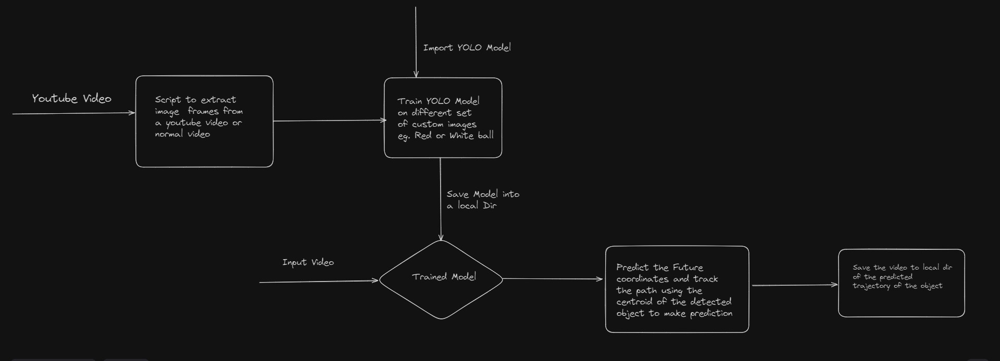

The project Trajectory Prediction and Ball Tracking is aimed at providing a prediction of the trajectory that a cricket ball will undertake to help players and
coaches understand and analyze performance.

# High Level Diagram

